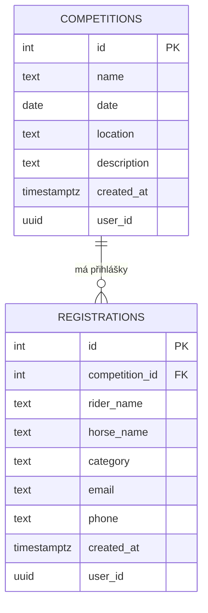

# PRD: Jezdecký klub — přihlašování na závody

## Problém
Jezdecký klub potřebuje jednoduchý systém pro správu závodů a přihlašování jezdců. Organizátor chce snadno vytvářet závody a vidět přihlášené, jezdci chtějí mít přehled o závodech a jednoduše se přihlásit.

## Cílový uživatel
Organizátoři jezdeckých závodů a jezdci, kteří se na závody přihlašují.

## User Stories
- Jako organizátor chci vytvořit nový závod, abych mohl zveřejnit termín a místo konání
- Jako jezdec chci vidět seznam nadcházejících závodů, abych věděl kam se můžu přihlásit
- Jako jezdec chci se přihlásit na závod s mým koněm, abych měl zajištěné místo
- Jako organizátor chci vidět seznam přihlášených na závod, abych věděl kolik jezdců očekávat
- Jako jezdec chci vidět detail závodu, abych znal pravidla a informace

## MVP Scope

### In scope
- Seznam závodů (název, datum, místo)
- Detail závodu s informacemi
- Přihlášení na závod (jméno jezdce, kůň, kategorie, kontakt)
- Seznam přihlášených u každého závodu
- Vytvoření nového závodu

### Out of scope
- Uživatelské účty a přihlašování
- Platby startovného
- Výsledky závodů
- Notifikace a emaily
- Historie závodů jezdce

## Datový model

### Tabulka: competitions
| Sloupec | Typ | Popis |
|---------|-----|-------|
| id | integer (PK) | Primární klíč |
| name | text | Název závodu |
| date | date | Datum konání |
| location | text | Místo konání |
| description | text | Popis a pravidla |
| created_at | timestamptz | Čas vytvoření |
| user_id | uuid | Reference na auth.users (pro budoucí auth) |

### Tabulka: registrations
| Sloupec | Typ | Popis |
|---------|-----|-------|
| id | integer (PK) | Primární klíč |
| competition_id | integer (FK) | Reference na competitions |
| rider_name | text | Jméno jezdce |
| horse_name | text | Jméno koně |
| category | text | Kategorie (např. parkur 80cm) |
| email | text | Kontaktní email |
| phone | text | Telefon (volitelné) |
| created_at | timestamptz | Čas přihlášení |
| user_id | uuid | Reference na auth.users (pro budoucí auth) |

## Diagram vztahů



## SQL pro Supabase

```sql
-- Tabulka závodů
CREATE TABLE competitions (
  id integer generated always as identity primary key,
  name text not null,
  date date not null,
  location text not null,
  description text,
  created_at timestamptz default now(),
  user_id uuid references auth.users(id)
);

ALTER TABLE competitions ENABLE ROW LEVEL SECURITY;
CREATE POLICY "competitions_allow_all" ON competitions FOR ALL USING (true) WITH CHECK (true);

-- Tabulka přihlášek
CREATE TABLE registrations (
  id integer generated always as identity primary key,
  competition_id integer references competitions(id) on delete cascade,
  rider_name text not null,
  horse_name text not null,
  category text not null,
  email text not null,
  phone text,
  created_at timestamptz default now(),
  user_id uuid references auth.users(id)
);

ALTER TABLE registrations ENABLE ROW LEVEL SECURITY;
CREATE POLICY "registrations_allow_all" ON registrations FOR ALL USING (true) WITH CHECK (true);
```
